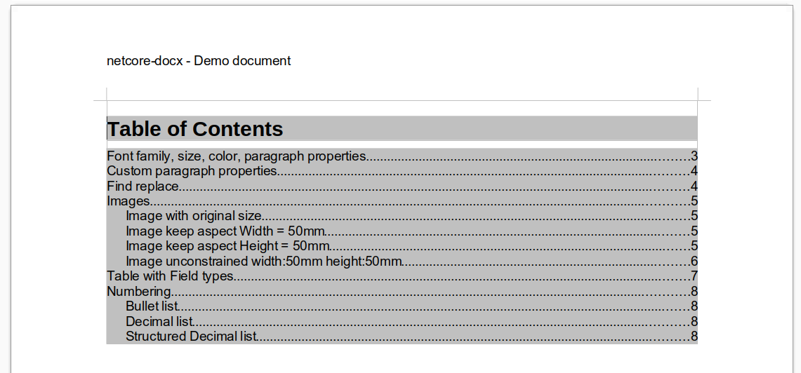
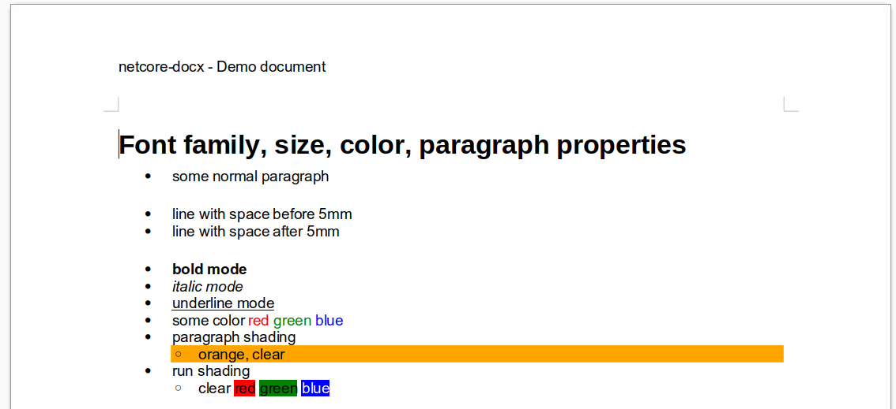
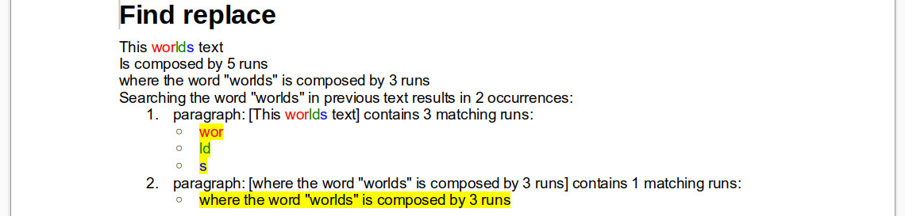
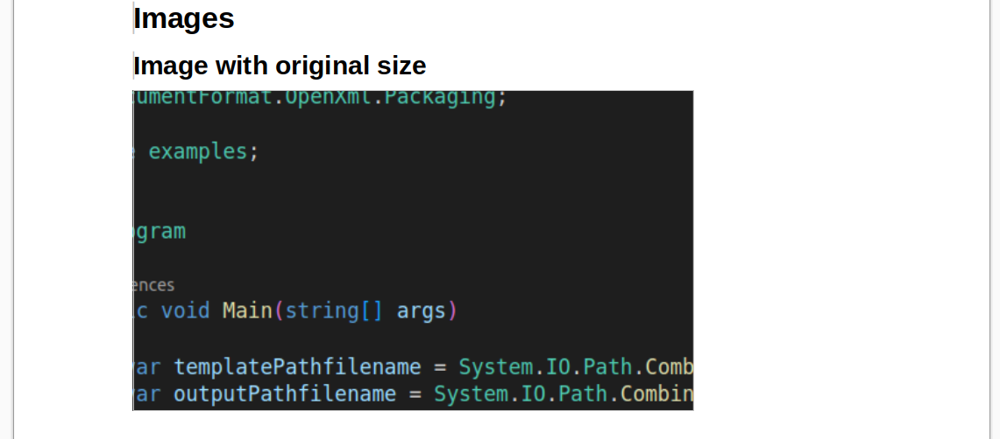
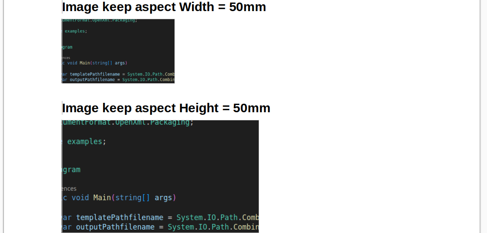
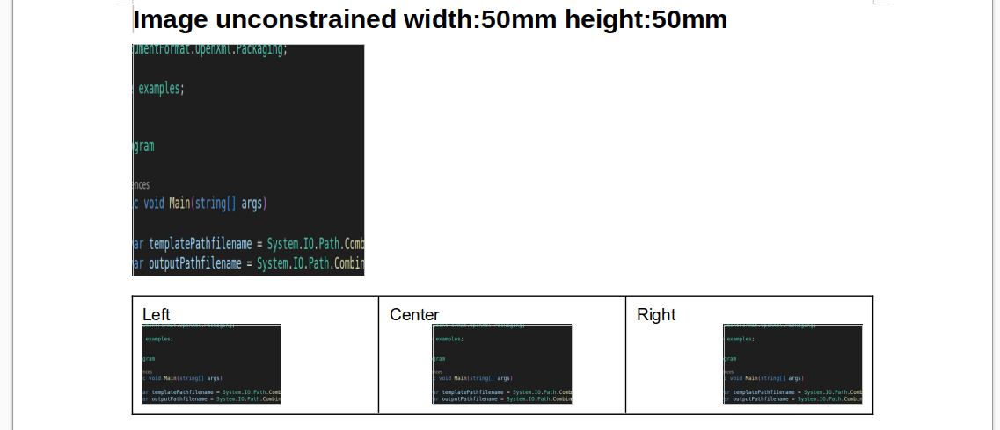
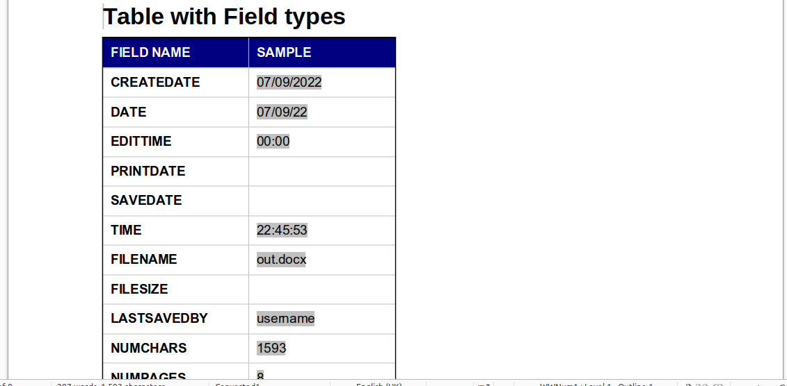
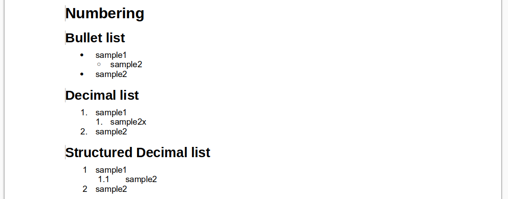

# netcore-docx

[](https://www.nuget.org/packages/netcore-docx/)

.NET core docx

- [API Documentation](https://devel0.github.io/netcore-docx/html/class_search_a_thing_1_1_doc_x_1_1_doc_x_ext.html)
- [Changelog](https://github.com/devel0/netcore-docx/commits/master)

<hr/>

<!-- TOC -->
* [description](#description)
* [quickstart](#quickstart)
  + [document creation](#document-creation)
  + [document default, main section properties, library](#document-default-main-section-properties-library)
  + [title and subtitle](#title-and-subtitle)
  + [toc](#toc)
  + [font family, size, color, paragraph properties](#font-family-size-color-paragraph-properties)
  + [custom paragraph style](#custom-paragraph-style)
  + [find and replace](#find-and-replace)
  + [images](#images)
  + [tables](#tables)
  + [numbering](#numbering)
* [TODO](#todo)
* [debugging](#debugging)
* [unit test](#unit-test)
* [install](#install)
* [how this project was built](#how-this-project-was-built)
* [references](#references)
<!-- TOCEND -->

<hr/>

## description

This is an extension methods set for [OpenXML SDK](https://github.com/OfficeDev/Open-XML-SDK).

This mean that there aren't wrapping classes around document, paragraph, run, style, etc... but extension methods that cohexists within OpenXML SDK.

This allow you to use any OpenXML SDK infrastructure in addition to provided simplified extensions methods without these interfere with a custom approach.

## quickstart

[example](examples/0001/Program.cs) shows basic usage through [sampledoc](sampledocs/SampleDoc2.cs)

### document creation

You can open an existing doc or create an empty docx eventually as a copy of an existing prestyled template document:

```cs
using DocumentFormat.OpenXml.Wordprocessing;
using DColor = System.Drawing.Color;

using SearchAThing.DocX;
using SearchAThing;

namespace examples;

class Program
{
    static void Main(string[] args)
    {        
        var outputPathfilename = System.IO.Path.Combine(
            Environment.GetFolderPath(Environment.SpecialFolder.Desktop), "out.docx");
                
        // note: initialize new empty document into given pathfilename saving for first time
        using (var doc = DocXToolkit.Create(outputPathfilename))
        {
            doc.AddParagraph("Sample paragraph");

            // note: remember to call doc.Finalize() to release associated dynamic resources
            doc.Finalize();
        }

        var psi = new ProcessStartInfo(outputPathfilename);
        psi.UseShellExecute = true;
        Process.Start(psi);
    }
}

```

- is highly suggested to call `Finalize()` method at the end of document usage to release resources allocated per document ( style libraries, state variables, ... ).
- `DColor` is an alias for `System.Drawing.Color`

### document default, main section properties, library

```cs
doc
    .SetDocDefaults(runFontName: "Arial");

doc
    .MainSectionProperties().SetPageSize(PaperSize.A4, PageOrientationValues.Portrait);

var titleStyle = doc.GetPredefinedStyle(LibraryStyleEnum.Title);
var subTitleStyle = doc.GetPredefinedStyle(LibraryStyleEnum.Subtitle);

var heading1Style = doc.GetPredefinedStyle(LibraryStyleEnum.Heading1);
var heading2Style = doc.GetPredefinedStyle(LibraryStyleEnum.Heading2);

var tableStyle = doc.GetPredefinedStyle(LibraryStyleEnum.Table);
var figureStyle = doc.GetPredefinedStyle(LibraryStyleEnum.Figure);
```

- `SetDocDefaults()` change default font, size, spacing, indentation, justification
- `MainSectionProperties()` allow access to base Section Properties; these will be used as backing store for actual section properties until you introduce a new one
- `GetPredefinedStyle()` retrieve one of predefined style ( see LibraryStyleEnum ) ; these styles came from a library that is instantiated foreach document through per document resources object ( because of specific number id, and other properties ).

### title and subtitle


```cs
doc
    .AddParagraph("netcore-docx", titleStyle);

doc
    .AddParagraph("Demo document", subTitleStyle);
```

- AddParagraph allow to insert a text and specify style to use for paragraph

### toc


note: TOC field updated from wordprocessor at first open ( not by the api )


```cs
doc
    .AddParagraph()
    .SectionProperties() // here a new section property will instantiated                        
        .SetHeader(header => header.AddParagraph("netcore-docx - Demo document"))
        .SetFooter(footer => footer
            .AddParagraph("Page ")
            .AddField(FieldEnum.PAGE)
            .AddText(" of ")
            .AddField(FieldEnum.NUMPAGES)
            .SetJustification(JustificationValues.Center)
        );

doc
    .AddToc("Table of Contents")
    .AddParagraph();

doc
    .AddBreak();
```

- `AddToc()` insert a predefined sdt block ( see `GenerateSdtBlock()` ) and trigger `UpdateFieldsOnOpen` because the TOC couldn't created at this model level without having exact page number position of elements that depends on document renderer program.

### font family, size, color, paragraph properties



```cs
doc
    .AddParagraph("Font family, size, color, paragraph properties", heading1Style)
    .EnableAutoNumbering()

    .AddParagraph("some normal paragraph")
    .AddParagraph("line with space before 5mm").SetSpacingBetweenLines(beforeMM: 5)
    .AddParagraph("line with space after 5mm").SetSpacingBetweenLines(afterMM: 5)
    .AddParagraph("bold mode").SetBold()
    .AddParagraph("italic mode").SetItalic()
    .AddParagraph("underline mode").SetUnderline()

    .AddParagraph("some color ")
        .AddRun("red", action: run => run.SetColor(DColor.Red))
        .AddRun(" green", action: run => run.SetColor(DColor.Green))
        .AddRun(" blue", action: run => run.SetColor(DColor.Blue))

    .AddParagraph("paragraph shading")
    .IncAutoNumbering()
        .AddParagraph("orange, clear").SetShading(DColor.Orange)
    .DecAutoNumbering()

    .AddParagraph("run shading")
        .IncAutoNumbering()
        .AddParagraph("clear ")
            .AddRun("red", action: run => run.SetShading(DColor.Red, ShadingPatternValues.Clear))
            .AddSpace().AddRun("green", action: run => run.SetShading(DColor.Green, ShadingPatternValues.Clear))
            .AddSpace().AddRun("blue", action: run => run.SetShading(DColor.Blue, ShadingPatternValues.Clear))
        .DecAutoNumbering()

    .DisableAutoNumbering();

doc
    .AddBreak();
```

- `EnableAutoNumbering()` is an helper to auto set numbering mode on any paragraph inserted after this command succeed; this command flag a value into per document resources object allowing DocX methods extensions to know that `SetNumbering()` has to be applied silently until `DisableAutoNumbering()` clear this behavior; during auto numbering `IncAutoNumbering()` and `DecAutoNumbering()` allow to increase/decrease numbering level (indentation). If don't want to use auto numbering you can set per paragraph numbering using `SetNumbering()`.
- `SetShading()` can applied with different behavior to a single Run or to an entire Paragraph.
- `AddBreak()` adds a manual page break ( if want to change section use `.SectionProperties()` instead )

### custom paragraph style


```cs
doc
    .AddParagraph("Custom paragraph properties", heading1Style);

{
    var myStyle1 = doc.AddParagraphSyle("myStyle1",
        runFontName: "Times New Roman",
        runFontColor: DColor.Blue,
        runFontSizePt: 14,
        spacingBetweenLinesOpts: new SpacingBetweenLinesOptions { AfterMM = 5 },
        indentationOpts: new IndentationOptions { },
        justification: JustificationValues.Left);

    doc.AddParagraph("paragraph with myStyle1", myStyle1);

    var myStyle2 = doc.AddParagraphSyle("myStyle2",
        runFontColor: DColor.Red,
        basedOn: myStyle1);

    doc.AddParagraph("paragraph with myStyle2 based on myStyle1", myStyle2);
}
```

- with `AddParagraphStyle()` you can add a new paragraph style from scratch ; if you can starts from a template docx may you find easily to prepare styles needed instead of creating them programmatically.

### find and replace



```cs
doc
    .AddParagraph("Find replace", heading1Style);

Paragraph? pref = null;

doc
    .AddParagraph("This ")
        .AddRun("wor", run => run.SetColor(DColor.Red))
        .AddRun("ld", run => run.SetColor(DColor.Green))
        .AddRun("s", run => run.SetColor(DColor.Blue))
        .AddRun(" text")
        .Act(p => pref = p)
    .AddParagraph($"Is composed by {pref!.GetRuns().Count()} runs")
    .AddParagraph("where the word \"worlds\" is composed by 3 runs");

var search = doc.FindText("worlds");

doc
    .AddParagraph(
        $"Searching the word \"worlds\" in previous text results in {search.Count} occurrences:");

foreach (var match in search)
{
    doc
        .AddParagraph($"paragraph: [")
            .AddRuns(match.Paragraph.GetRuns().Select(r => (Run)r.Clone()))
            .AddRun($"] contains {match.Runs.Count} matching runs:")
            .SetNumbering(0, NumberFormatValues.Decimal);

    foreach (var matchingrun in match.Runs)
    {
        doc.AddParagraph()
            .AddRun(((Run)matchingrun.Clone()).Act(run =>
                run.SetShading(DColor.Yellow)))
            .SetNumbering(1, NumberFormatValues.Bullet);
    }
}

doc
    .AddBreak();
```

- `FindText()` actually works by searching text occurrence in all the document and returns a list of paragraphs that contains occurrence.
- `FindAndReplace()` like FindText() works over all document contents by searching text and replacing with text substitution specified; specifically it can replace existing text runs by maintaining their run properties until replaced text length not exceeded the existant one and using last run properties for remaining addictional text; an option `SplitAndCreateSingleRun` allow to replace matching multiple run into single run by trimming and stitching in order to ensure that replaced text will exists in a single run ( could used to uniform as a single run some template document keyword edited by hand causing multiple run across a single keyword to be used subsequently for an automated document creation )

### images







```cs
doc
    .AddParagraph("Images", heading1Style)
    .AddParagraph("Image with original size", heading2Style)
    .AddImage(img01pathfilename)
    .AddParagraph()

    .AddParagraph("Image keep aspect Width = 50mm", heading2Style)
    .AddImage(img01pathfilename, widthMM: 50)
    .AddParagraph()

    .AddParagraph("Image keep aspect Height = 50mm", heading2Style)
    .AddImage(img01pathfilename, heightMM: 50)
    .AddParagraph()

    .AddParagraph("Image unconstrained width:50mm height:50mm", heading2Style)
    .AddImage(img01pathfilename, widthMM: 50, heightMM: 50)
    .AddParagraph()

    .AddTable()
        .AddColumns(3, 1)
        .AddRow(row =>
        {
            row.GetCell(0)
                .SetParagraph("Left")
                .AddImage(img01pathfilename, widthMM: 30)
                .SetJustification(JustificationValues.Left);

            row.GetCell(1)
                .SetParagraph("Center")
                .AddImage(img01pathfilename, widthMM: 30)
                .SetJustification(JustificationValues.Center);

            row.GetCell(2)
                .SetParagraph("Right")
                .AddImage(img01pathfilename, widthMM: 30)
                .SetJustification(JustificationValues.Right);

            var cellsCount = row.Elements<TableCell>().Count();
            for (int i = 0; i < cellsCount; ++i) row.GetCell(i).SetPadding(2);
        })
        .SetBorderAll()
    .AddBreak();
```

- `AddImage()` adds an inline image into a paragraph or a run ; if not specified the type if auto states type from file extension ; `dpi` if present are used to state original dimension and aspect ratio ; can be inserted without specify width, height to use original dimension or constraining one of them keeping aspect ratio or constraining all of them to force stretched version.

### tables



```cs
doc
    .AddParagraph("Table with Field types", heading1Style);

var tbl = doc
    .AddTable(tableWidthPercent: 50)
    .AddColumn(1).AddColumn(1);

tbl.AddRow(row =>
{
    row.GetCell(0)
        .SetShading(DColor.Navy)
        .SetParagraph("FIELD NAME", run => run.SetBold().SetColor(DColor.White))
        .SetUniformMargin(2);

    row.GetCell(1)
        .SetShading(DColor.Navy)
        .SetParagraph("SAMPLE", run => run.SetBold().SetColor(DColor.White))
        .SetUniformMargin(2);
});

foreach (var t in Enum.GetValues<FieldEnum>())
{
    tbl.AddRow(row =>
    {
        row.GetCell(0).SetParagraph(t.ToString(), run => run.SetBold()).SetUniformMargin(2);
        row.GetCell(1).GetFirstChild<Paragraph>()!.AddField(t).SetUniformMargin(2);
    });
}

tbl.SetBorderOutside(BorderValues.Single);

doc
    .AddBreak();
```

- paragraph `AddTable()` adds a table with specified % width or if null auto computed from columns
- table `AddColumn()` adds column to the table specifying an exact MM measure if table work with fixed width ( tableWidthPercent: null ); instead of table uses a % width the column widthMM will normalized across all columns to reach table width extents.
- table `AddRow()` adds an empty row already filled with enough cells to cover actual table columns
- row `GetCell()` retrieve Table Cell from which you may use `.SetParagraph()` in place of `.AddParagraph()` because empty cells prepared with an empty paragraph.
    - an helper row `SetUniformMargin()` allow to set margin around cell contents
- table `SetBorderOutside()` sets outer table cells border to Single or specified Border type. Alternatively `SetBorderAll()` or `SetBorder()` can be used to set all cells outer/inner or custom border.

### numbering



```cs
doc
    .AddParagraph("Numbering", heading1Style)

    .AddParagraph("Bullet list", heading2Style)
    .AddParagraph("sample1").SetNumbering(0)
    .AddParagraph("sample2").SetNumbering(1)
    .AddParagraph("sample2").SetNumbering(0)

    .AddParagraph("Decimal list", heading2Style)
    .AddParagraph("sample1").SetNumbering(0, NumberFormatValues.Decimal, restartNumbering: true)
    .AddParagraph("sample2x").SetNumbering(1, NumberFormatValues.Decimal)
    .AddParagraph("sample2").SetNumbering(0, NumberFormatValues.Decimal)

    .AddParagraph("Structured Decimal list", heading2Style)
    .AddParagraph("sample1").SetNumbering(0, NumberFormatValues.Decimal, structured: true)
    .AddParagraph("sample2").SetNumbering(1, NumberFormatValues.Decimal, structured: true)
    .AddParagraph("sample2").SetNumbering(0, NumberFormatValues.Decimal, structured: true);

doc
    .AddBreak();
```

- `SetNumbering(level, [format:bullet], [structured:false])` allow to specify that a paragraph is marked in its property to be a numbering ; `level` specify indentation level 0...9 ; `format` specify the type of numering ( actually library supports None, Bullet, Decimal ) ; `structured: true` used in conjunction with Decimal format allow to enumerate inside levels with recall of parent levels.

## TODO

- single imagepart insertion
- double check document validate

## debugging

- useful tools : [OpenXML SDK Tools 2.5](https://github.com/OfficeDev/Open-XML-SDK/releases/tag/v2.5)

## unit test

```sh
dotnet test
```

## install

- [nuget package](https://www.nuget.org/packages/netcore-docx/)

## how this project was built

```sh
mkdir netcore-docx
cd netcore-docx

dotnet new sln
dotnet new classlib -n netcore-docx

cd netcore-docx
dotnet add package DocumentFormat.OpenXml --version 2.8.1
cd ..

dotnet sln netcore-docx.sln add netcore-docx/netcore-docx.csproj
dotnet restore
dotnet build
```

## references

- [open xml sdk doc](https://github.com/OfficeDev/office-content/tree/master/en-us/OpenXMLCon)

